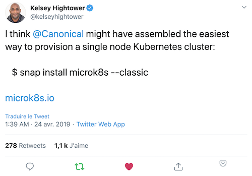

MicroK8s est un outil axé sur la simplicité et l'expérience développeur. Il est notamment très adapté pour l'IoT, l'Edge computing, ... C'est une distribution légère, qui fournit de nombreux add-ons, composants pré-packagés donnant à Kubernetes des capacités supplémentaires: de la simple gestion DNS à l'apprentissage automatique avec Kubeflow.



Sur Windows, MacOS ou Linux, MicroK8s peut facilement être installé dans une machine virtuelle. Nous utiliserons [Multipass](https://multipass.run) un outils très pratique qui permet de lancer facilement des machines virtuelles Ubuntu sur Mac, Linux, ou Windows.

Note: l'installation de Multipass et l'illustration des différentes commandes ont été détaillées dans un exercice précédent, n'hésitez pas à vous reporter.


### 1. Création d'une VM Ubuntu

Utilisez la commande suivante pour créer une VM Ubuntu 18.04 avec Multipass, cela ne prendra que quelques dizaines de secondes:

```
$ multipass launch --name microk8s --mem 4G
```

### 2. Installation de microk8s dans la VM

Utilisez la commande suivante pour lancer l'installation de microk8s dans la VM que vous venez de provisionner:

```
$ multipass exec microk8s -- sudo snap install microk8s --classic
```

### 3. Fichier de configuration

Récupérez, sur votre machine locale, le fichier de configuration généré par microk8s:

```
$ multipass exec microk8s -- sudo microk8s.config > microk8s.yaml
```

Utilisez ensuite la commande suivante afin de positionner la variable d'environnement KUBECONFIG de façon à ce qu'elle pointe vers le fichier de configuration récupéré précédemment:

```
$ export KUBECONFIG=$PWD/microk8s.yaml
```

### 4. Accès au cluster

Nous pouvons maintenant accéder au cluster et lister les nodes:

```
$ kubectl get nodes
NAME       STATUS   ROLES    AGE    VERSION
microk8s   Ready    <none>   2m8s   v1.20.2-34+350770ed07a558
```

### 5. Add-ons

Microk8s est livré avec de multiples addons dont la liste peut être obtenue avec la commande suivante:

```
ubuntu@microk8s:~$ microk8s status
microk8s is running
high-availability: no
  datastore master nodes: 127.0.0.1:19001
  datastore standby nodes: none
addons:
  enabled:
    ha-cluster           # Configure high availability on the current node
  disabled:
    ambassador           # Ambassador API Gateway and Ingress
    cilium               # SDN, fast with full network policy
    dashboard            # The Kubernetes dashboard
    dns                  # CoreDNS
    fluentd              # Elasticsearch-Fluentd-Kibana logging and monitoring
    gpu                  # Automatic enablement of Nvidia CUDA
    helm                 # Helm 2 - the package manager for Kubernetes
    helm3                # Helm 3 - Kubernetes package manager
    host-access          # Allow Pods connecting to Host services smoothly
    ingress              # Ingress controller for external access
    istio                # Core Istio service mesh services
    jaeger               # Kubernetes Jaeger operator with its simple config
    keda                 # Kubernetes-based Event Driven Autoscaling
    knative              # The Knative framework on Kubernetes.
    kubeflow             # Kubeflow for easy ML deployments
    linkerd              # Linkerd is a service mesh for Kubernetes and other frameworks
    metallb              # Loadbalancer for your Kubernetes cluster
    metrics-server       # K8s Metrics Server for API access to service metrics
    multus               # Multus CNI enables attaching multiple network interfaces to pods
    portainer            # Portainer UI for your Kubernetes cluster
    prometheus           # Prometheus operator for monitoring and logging
    rbac                 # Role-Based Access Control for authorisation
    registry             # Private image registry exposed on localhost:32000
    storage              # Storage class; allocates storage from host directory
    traefik              # traefik Ingress controller for external access
```

Avant d'utiliser le cluster et de déployer des applications, il est nécessaire d'installer *CodeDNS* via le addon *dns*.

```
ubuntu@microk8s:~$ microk8s enable dns
```

Le cluster est maintenant prêt à être utilisé.


Microk8s est une solution très adaptée pour mettre en place une installation locale de  Kubernetes. C'est également une distribution qui peut etre configurée avec plusieurs nodes et utilisée dans un environnement de production.

