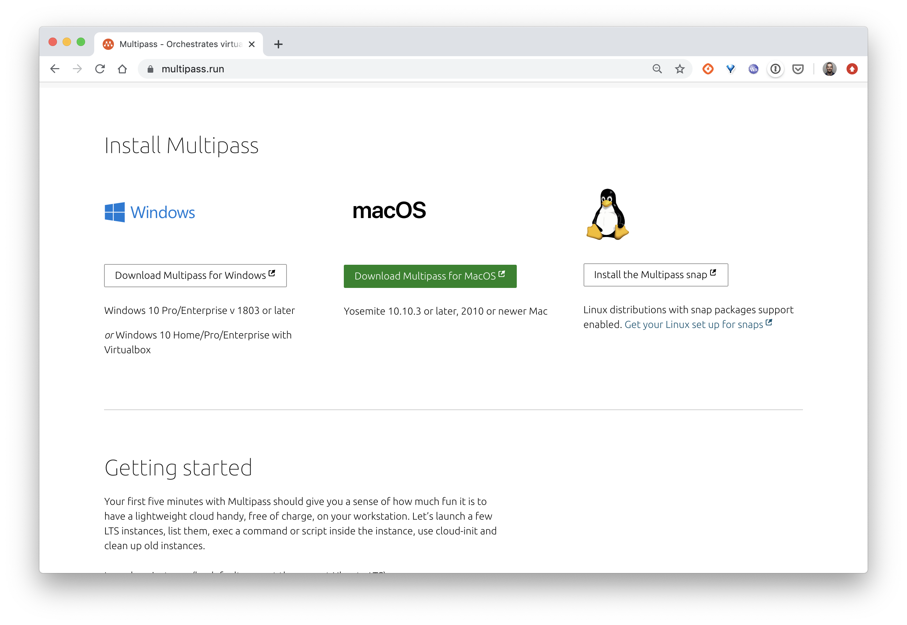

Multipass est un utilitaire développé par Canonical, il permet de lancer des machines virtuelles Ubuntu facilement.

En fonction de l'OS, Multipass peut utiliser différents hyperviseurs:
- Hyper-V
- HyperKit
- KVM
- VirtualBox

En s'intégrant de manière native à ces hyperviseurs, il permet de démarrer des machines virtuelles très rapidement.

## Installation

Vous trouverez sur le site [https://multipass.run](https://multipass.run) la procédure d'installation de Multipass en fonction de votre OS.



## Commandes disponibles

La liste des commandes disponibles pour la gestion du cycle de vie des VMs peut être obtenue avec la commande suivante:

```
$ multipass
Usage: multipass [options] <command>
Create, control and connect to Ubuntu instances.

This is a command line utility for multipass, a
service that manages Ubuntu instances.

Options:
  -h, --help     Display this help
  -v, --verbose  Increase logging verbosity. Repeat the 'v' in the short option
                 for more detail. Maximum verbosity is obtained with 4 (or more)
                 v's, i.e. -vvvv.

Available commands:
  delete    Delete instances
  exec      Run a command on an instance
  find      Display available images to create instances from
  get       Get a configuration setting
  help      Display help about a command
  info      Display information about instances
  launch    Create and start an Ubuntu instance
  list      List all available instances
  mount     Mount a local directory in the instance
  networks  List available network interfaces
  purge     Purge all deleted instances permanently
  recover   Recover deleted instances
  restart   Restart instances
  set       Set a configuration setting
  shell     Open a shell on a running instance
  start     Start instances
  stop      Stop running instances
  suspend   Suspend running instances
  transfer  Transfer files between the host and instances
  umount    Unmount a directory from an instance
  version   Show version details
```

Nous allons voir quelques unes de ces commandes sur des exemples.

## Quelques exemples

La manipulation de VMs se fait très facilement:

- création d'une nouvelle VM nommée *node1* (en quelques dizaines de secondes seulement)

```
$ multipass launch -n node1
Launched: node1
```

Par défaut cette VM est configurée avec 1G de RAM, 1 cpu et 5 Go de disque mais différentes options peuvent être utilisées pour modifier ces valeurs. La commande suivante permet par exemple de créer une VM nommée *node2* avec 2 cpu, 3 Go de RAM et 10 Go de disque:

```
$ multipass launch -n node2 -c 2 -m 3G -d 10G
Launched: node2
```

- information sur une VM

La commande suivante retourne les différents paramètres de configuration de la VM

```
$ multipass info node1
Name:           node1
State:          Running
IPv4:           192.168.64.11
Release:        Ubuntu 20.04.2 LTS
Image hash:     c5f2f08c6a1a (Ubuntu 20.04 LTS)
Load:           1.62 0.44 0.15
Disk usage:     1.2G out of 4.7G
Memory usage:   136.7M out of 981.4M
```

Il est également possible d'obtenir ces informations dans les formats json, csv ou yaml. Exemple en json:

```
$ multipass info node1 --format json
{
    "errors": [
    ],
    "info": {
        "node1": {
            "disks": {
                "sda1": {
                    "total": "5019643904",
                    "used": "1339346944"
                }
            },
            "image_hash": "c5f2f08c6a1adee1f2f96d84856bf0162d33ea182dae0e8ed45768a86182d110",
            "image_release": "20.04 LTS",
            "ipv4": [
                "192.168.64.11"
            ],
            "load": [
                1.57,
                0.48,
                0.17
            ],
            "memory": {
                "total": 1029033984,
                "used": 143314944
            },
            "mounts": {
            },
            "release": "Ubuntu 20.04.2 LTS",
            "state": "Running"
        }
    }
}
```

- liste des VM créés

```
$ multipass list
Name                    State             IPv4             Image
node1                   Running           192.168.64.11    Ubuntu 20.04 LTS
node2                   Running           192.168.64.12    Ubuntu 20.04 LTS
```

- Lancement d'un shell dans la VM *node1*

```
$ multipass shell node1
Welcome to Ubuntu 20.04.2 LTS (GNU/Linux 5.4.0-66-generic x86_64)

 * Documentation:  https://help.ubuntu.com
 * Management:     https://landscape.canonical.com
 * Support:        https://ubuntu.com/advantage

  System information as of Fri Feb 26 09:25:36 CET 2021

  System load:  0.97              Processes:               114
  Usage of /:   26.7% of 4.67GB   Users logged in:         0
  Memory usage: 19%               IPv4 address for enp0s2: 192.168.64.11
  Swap usage:   0%


1 update can be installed immediately.
0 of these updates are security updates.
To see these additional updates run: apt list --upgradable


To run a command as administrator (user "root"), use "sudo <command>".
See "man sudo_root" for details.

ubuntu@node1:~$
```

On obtient alors un shell avec l'utilisateur *ubuntu* qui est notamment dans le groupe *sudo*.

- lancement d'une commande dans une VM

La commande suivante permet d'installer Docker dans la VM *node1*

```
$ multipass exec node1 -- /bin/bash -c "curl -sSL https://get.docker.com | sh"
```

On peut alors vérifier que l'installation s'est déroulée correctement:

```
$ multipass exec node1 -- sudo docker version
Client: Docker Engine - Community
 Version:           20.10.3
 API version:       1.41
 Go version:        go1.13.15
 Git commit:        48d30b5
 Built:             Fri Jan 29 14:33:21 2021
 OS/Arch:           linux/amd64
 Context:           default
 Experimental:      true

Server: Docker Engine - Community
 Engine:
  Version:          20.10.3
  API version:      1.41 (minimum version 1.12)
  Go version:       go1.13.15
  Git commit:       46229ca
  Built:            Fri Jan 29 14:31:32 2021
  OS/Arch:          linux/amd64
  Experimental:     false
 containerd:
  Version:          1.4.3
  GitCommit:        269548fa27e0089a8b8278fc4fc781d7f65a939b
 runc:
  Version:          1.0.0-rc92
  GitCommit:        ff819c7e9184c13b7c2607fe6c30ae19403a7aff
 docker-init:
  Version:          0.19.0
  GitCommit:        de40ad0
```

- montage d'un répertoire local dans une VM

```
# Création d'un fichier en local
$ mkdir /tmp/test && touch /tmp/test/hello

# Montage du répertoire dans le filesystem de la VM node1
$ multipass mount /tmp/test node1:/usr/share/test

# Vérification
$ multipass exec node1 -- ls /usr/share/test
hello
```

La commande *umount* permet de faire l'opération inverse et de supprimer ce point de montage:

```
$ multipass umount node1:/usr/share/test
```

- copie de fichiers entre la machine local et les VMs

Il est possible de transférer des fichiers locaux vers une VM et inversement, sans avoir à monter un répertoire (cf exemple précédent)

```
# Copie d'un fichier depuis la machine locale
$ multipass transfer /tmp/test/hello node1:/tmp/hello

# Vérification
$ multipass exec node1 -- ls /tmp/hello
/tmp/hello
```

- les commandes start / stop / restart / delete permettent de gérer le cycle de vie des VMs

```
$ multipass delete -p node1 node2
```

## En résumé

Comme nous venons de le voir dans les exemples ci-dessus, Multipass est un utilitaire très pratique et extrêmement simple d'utilisation. Je vous conseille de l'installer car vous pourrez l'utiliser dans la suite pour instancier plusieurs VMs et mettre en place un cluster Kubernetes en local.
