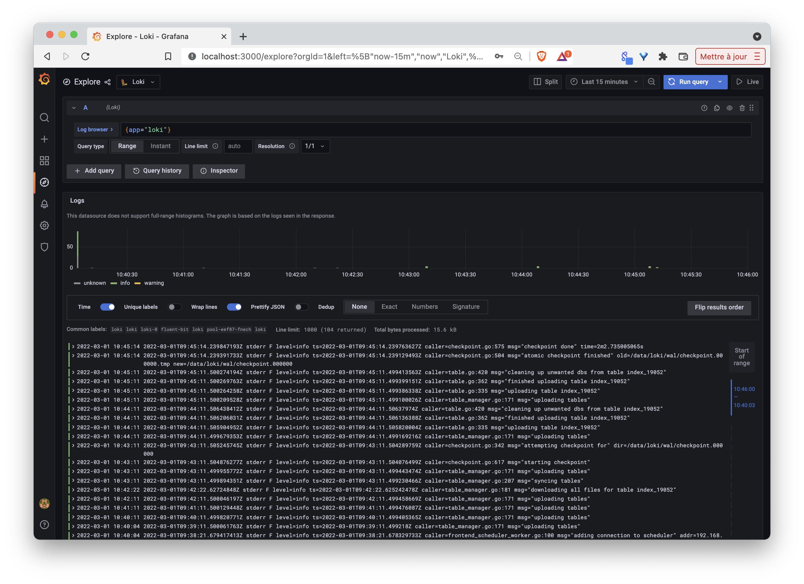
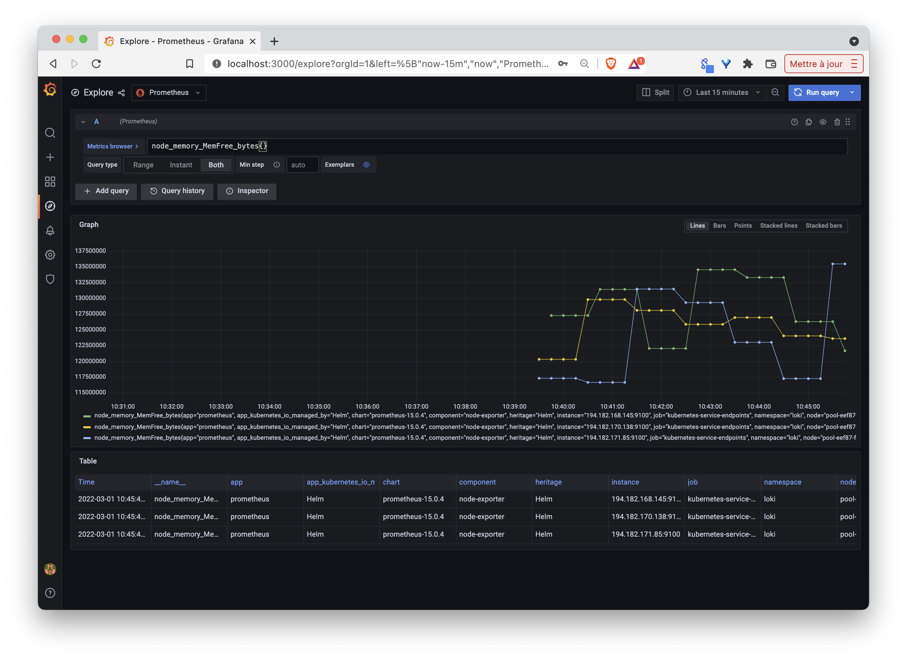

Dans cet exercice, vous allez installer la stack Loki en tant que chart Helm. 

## A propos de la Loki Stack

La stack Loki contient différents composants permettant de collecter et de visualiser des données de monitoring et des logs.

La documentation du chart Helm est disponible sur [https://github.com/grafana/helm-charts/tree/main/charts/loki-stack](https://github.com/grafana/helm-charts/tree/main/charts/loki-stack)

## Prérequis

1. Il est nécessaire que le client *helm* soit installé sur votre machine. Si ce n'est pas le cas vous pouvez l'installer en suivant [ces instructions](https://gitlab.com/lucj/k8s-exercices/-/blob/master/Helm/helm-client.md)

2. Certains éléments de la stack nécessite qu'une solution de stockage soit installé sur le cluster

Utilisez la commande suivante pour vérifier si il y a une *StorageClass* dans votre cluster:

```
kubectl get sc
```

Si celle-ci ne renvoie rien, vous pouvez installer *Longhorn* une solution qui met en place un stockage distribué dans le cluster:

```
kubectl apply -f https://raw.githubusercontent.com/longhorn/longhorn/master/deploy/longhorn.yaml
```

Définissez ensuite la *StorageClass* créée par *Longhorn* comme celle utilisée par défaut:

```
kubectl patch storageclass longhorn -p '{"metadata": {"annotations":{"storageclass.kubernetes.io/is-default-class":"true"}}}'
```

Note: vous pouvez vous reporter à [l'exercice sur Longhorn](https://gitlab.com/lucj/k8s-exercices/-/blob/master/Application-Stateful/longhorn.md) si vous souhaitez avoir des informations supplémentaires sur son utilisation

## Add Loki repo

Premièrement, ajoutez le repository Grafana à l'aide de la commande suivante

```
helm repo add grafana https://grafana.github.io/helm-charts
```

Ensuite, mettez à jour l'ensemble des repos afin que le client Helm connaisse les différentes versions des charts

```
helm repo update
```

## Installation

Créez tout d'abord le namespace *loki* dans lequel sera déployée cette stack

```
kubectl create ns loki
```

Installez ensuite la stack loki en tant que chart Helm. Utilisez pour cela la commande suivante, celle-ci définit les différents composants qui seront installés:

- *fluent-bit* pour la collecte des logs
- *prometheus* pour la collecte et le stockage de données de monitoring
- *grafana* pour la visualisation des données (à la fois des métriques et des logs)

```
helm upgrade --install loki grafana/loki-stack \
  --namespace loki \
  --set fluent-bit.enabled=true \
  --set promtail.enabled=false \
  --set prometheus.enabled=true \
  --set grafana.enabled=true
```

Après quelques dizaines de secondes, vous devriez avoir un ensemble de Pods dans l'état running dans le namespace *loki*:

```
$ kubectl get pod -n loki
NAME                                            READY   STATUS    RESTARTS   AGE
loki-0                                          1/1     Running   0          80s
loki-fluent-bit-loki-cbt4k                      1/1     Running   0          81s
loki-fluent-bit-loki-cxkh6                      1/1     Running   0          80s
loki-fluent-bit-loki-ggl8m                      1/1     Running   0          80s
loki-grafana-7dc68d5d48-95spb                   2/2     Running   0          80s
loki-kube-state-metrics-bd6d445d-bjbbz          1/1     Running   0          80s
loki-prometheus-alertmanager-588db464c7-52dht   2/2     Running   0          80s
loki-prometheus-node-exporter-hj57k             1/1     Running   0          81s
loki-prometheus-node-exporter-ssn5x             1/1     Running   0          81s
loki-prometheus-node-exporter-xcbp2             1/1     Running   0          81s
loki-prometheus-pushgateway-5c845f48b5-pg2w6    1/1     Running   0          80s
loki-prometheus-server-b5bc67cb4-z9w78          2/2     Running   0          81s
```

## Accès à l'interface de Grafana

- récupération du mot de passe

La commande suivante permet de récupérer le mot de passe créé par défaut pour pouvoir se connecter à l'interface Grafana:

```
kubectl get secret loki-grafana --namespace=loki -o jsonpath="{.data.admin-password}" | base64 --decode
```

- exposition de l'interface

Utilisez la commande suivante pour exposer Grafana sur le port 3000 de la machine locale:

```
kubectl port-forward --namespace loki service/loki-grafana 3000:80
```

Vous pourrez alors vous connecter avec l'utilisateur *admin* et le mot de passe récupéré précédemment.

- exploration des données

Depuis le menu *Explore*, dans la barre de gauche, vous pourrez alors utiliser les datasources *Loki* ou *Prometheus* afin de visualiser respectivement les logs et les données de monitoring du cluster





Grafana permet également d'aller plus loin en créant vos propres dashboards de visualisation.

## Cleanup

Supprimer la stack *Loki* avec la commande suivante:

```
helm uninstall loki -n loki
```