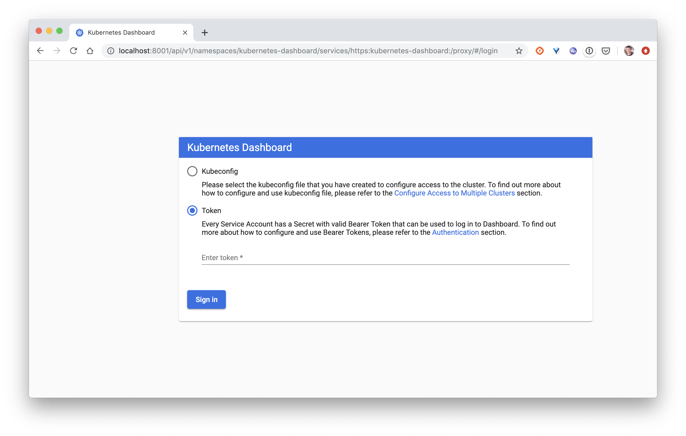
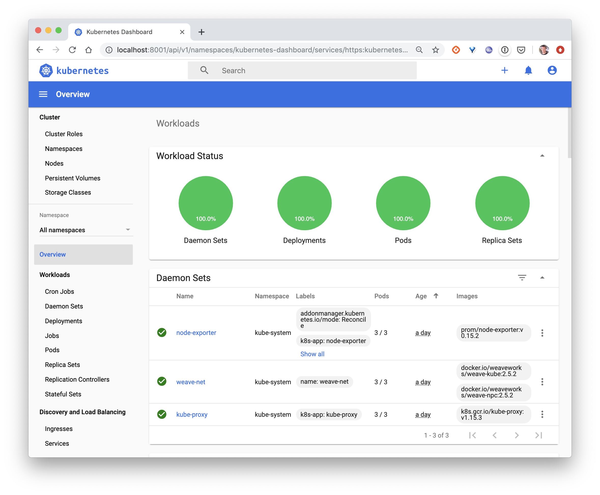
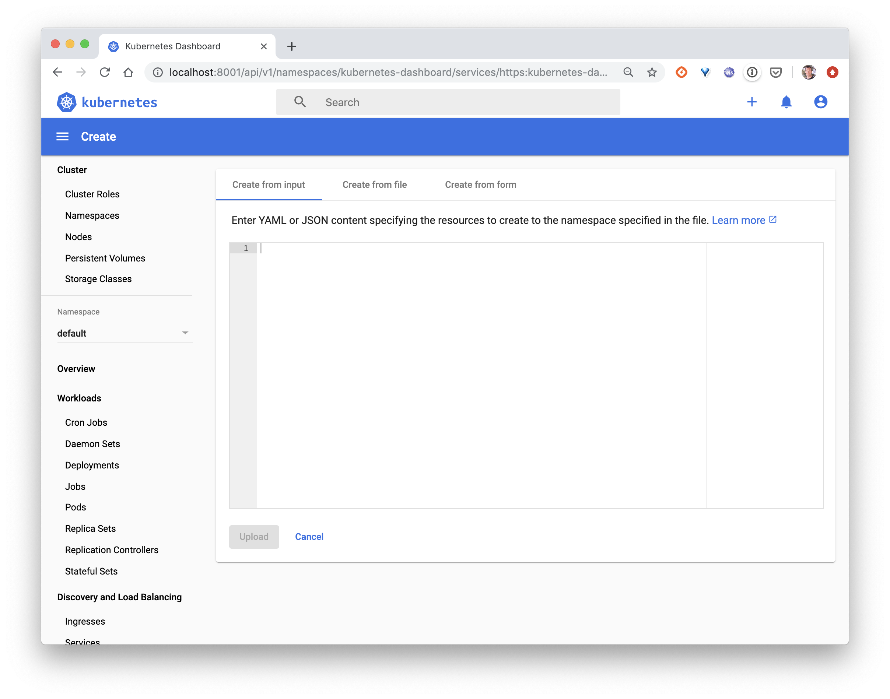
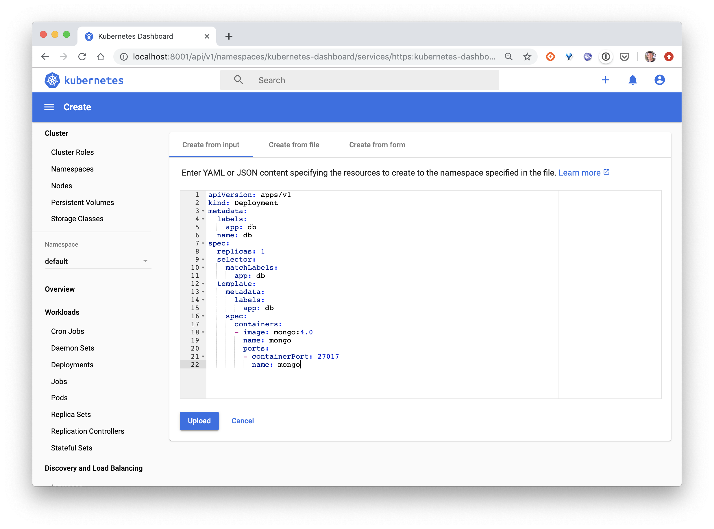
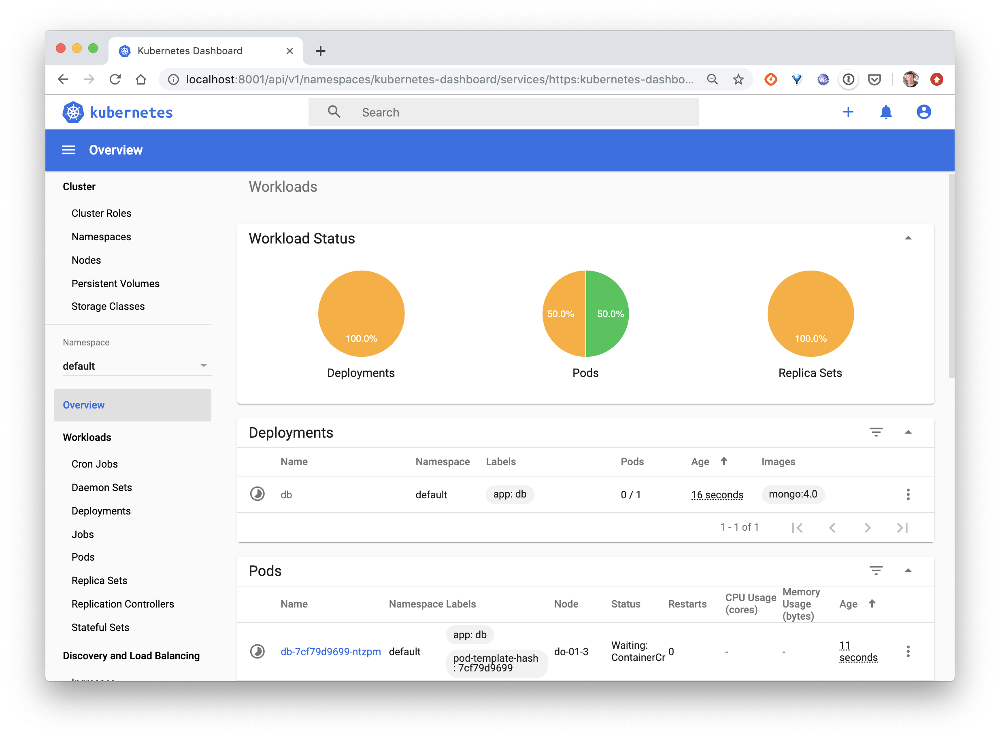
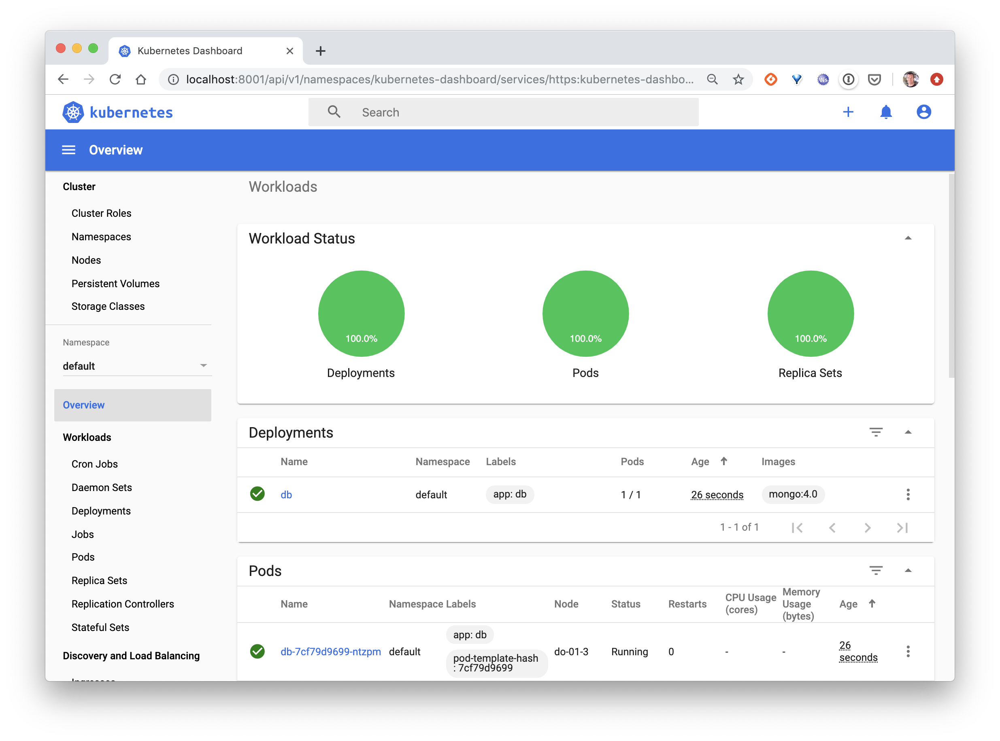
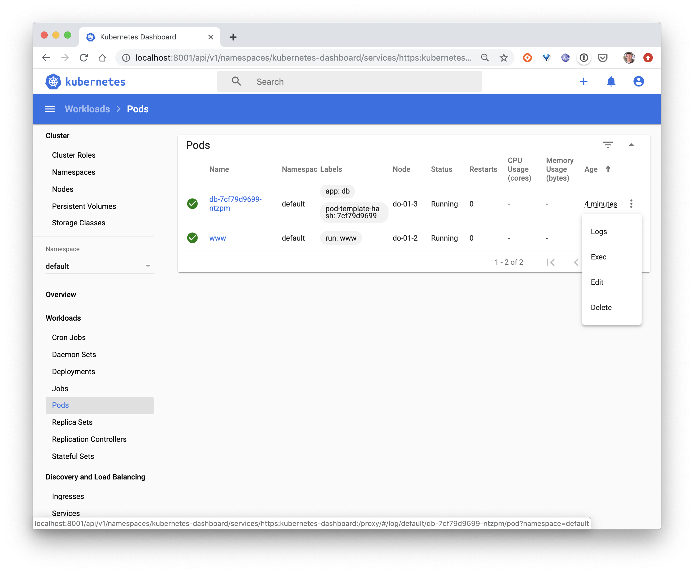
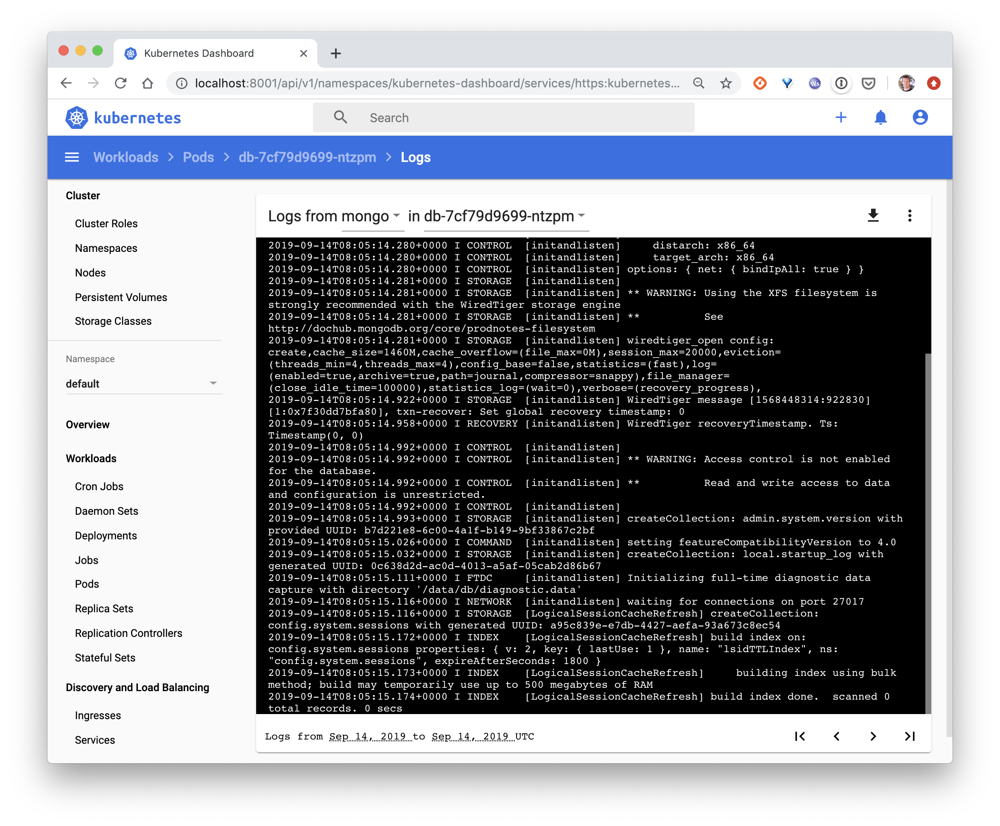

Dans cet exercice vous allez déployer le dashboard Kubernetes et l'utiliser pour faire des opérations au sein de votre cluster.

## Installation

### 1er cas: vous utilisez Minikube

Si vous êtes sur Minikube, l'installation est très simple, il suffit d'activer l'addon correspondant. Cela peut se faire avec la commande suivante:

```
$ minikube addons enable dashboard
```

Vous n'avez alors plus qu'à lancer l'interface qui s'ouvrira automatiquement dans votre navigateur:

```
$ minikube dashboard
```

### 2ème cas: vous n'utilisez pas Minikube

Si vous n'êtes pas sur Minikube, il vous faut créer le Deployment qui lancera le dashboard dans un Pod. Vous pouvez le faire avec la commande suivante:

```
$ kubectl apply -f https://raw.githubusercontent.com/kubernetes/dashboard/master/aio/deploy/recommended.yaml
```

Afin d'accéder à l'interface, vous allez lancer le *proxy* Kubernetes:

```
$ kubectl proxy
```

En passant par ce proxy, l'interface est disponible en utilisant l'adresse http://localhost:8001/api/v1/namespaces/kubernetes-dashboard/services/https:kubernetes-dashboard:/proxy/



Afin de pouvoir vous logger sur l'interface vous pouvez:

- uploader votre fichier kubeconfig.

- copier le token associé à l'utilisateur qui se trouve dans votre fichier *kubeconfig* (si ce token existe et que les droits cluster-admin lui sont associés)

- ou bien créer un token d'authentification avec les droits d'administration. Pour illustrer cette seconde solution, nous allons:

  * créer un ServiceAccount nommé *admin-user*

```
$ kubectl apply -f -<<EOF
apiVersion: v1
kind: ServiceAccount
metadata:
  name: admin-user
  namespace: kube-system
EOF
```

  * créer un *ClusterRoleBinding* afin de donner les droits d'administration du cluster au ServiceAccount précédent

```
$ kubectl apply -f -<<EOF
apiVersion: rbac.authorization.k8s.io/v1
kind: ClusterRoleBinding
metadata:
  name: admin-user
roleRef:
  apiGroup: rbac.authorization.k8s.io
  kind: ClusterRole
  name: cluster-admin
subjects:
- kind: ServiceAccount
  name: admin-user
  namespace: kube-system
EOF
```

  * récupérer le token associé au ServiceAccount

```
$ echo $(kubectl -n kube-system get secret $(kubectl -n kube-system get secret | grep admin-user | awk '{print $1}') -o jsonpath='{.data.token}') | base64 --decode
```

Il suffit alors de copier ce token dans l'interface pour accéder au dashboard:


Comme on peut le voir ici, le cluster utilisé dans cet exemple contient déjà plusieurs ressources. Les ressources du cluster que vous utilisez seront différentes.



## Déployment d'une application

En cliquant sur l'icone *+* en haut à droite, il est possible de créer une ressources à l'aide de différentes approches:
- en renseignant le contenu d'une spécification, en yaml ou json (*Create from input*)
- en important un fichier de spécification existant (*Create from file*)
- en utilisant un formulaire, mais cette approche sera plus limitée en ce qui concerne le nombre d'options qui peuvent être utilisées (*Create from form*)



Ici, nous allons simplement créer un Deployment définissant un Pod dont l'unique container est basé sur *mongo:4.0*.

```
apiVersion: apps/v1
kind: Deployment
metadata:
  name: db
  labels:
    app: db
spec:
  selector:
    matchLabels:
      app: db
  template:
    metadata:
      labels:
        app: db
    spec:
      containers:
      - name: mongo
        image: mongo:4.0
        ports:
        - containerPort: 27017
```



Une fois que vous avez cliqué sur *Upload*, vous pourrez voir que le Deployment, le ReplicaSet ainsi que le Pod sont en cours de création.



Ils deviennent actifs au bout de quelques secondes



Il est possible d'effectuer différentes action sur les ressources que l'on vient de créer. Si l'on s'intéresse au Pod, on peut par exemple:
- visualiser ses logs
- lancer un shell à l'intérieur du container *mongo*
- modifier sa spécification
- le supprimer



Le screenshot suivant montre la récupération des logs du container *mongo*



N'hésitez pas à naviguer dans cette interface et à déployer d'autres ressources.
